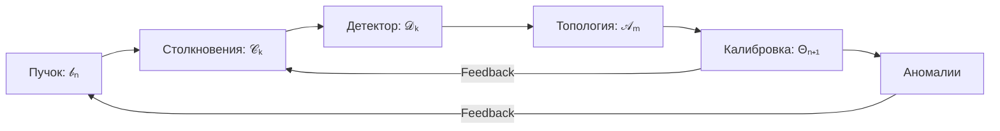

# Полная математическая модель гибридной системы LHC

## 1. Математическая модель динамики пучка

### 1.1. Уравнения движения частиц в магнитном поле

Движение заряженных частиц в магнитном поле описывается уравнением Лоренца:

$$\frac{d\mathbf{p}}{dt} = q(\mathbf{E} + \mathbf{v} \times \mathbf{B})$$

Где:
- $\mathbf{p} = \gamma m \mathbf{v}$ - релятивистский импульс частицы
- $q$ - заряд частицы
- $\mathbf{E}$ - напряженность электрического поля
- $\mathbf{v}$ - скорость частицы
- $\mathbf{B}$ - индукция магнитного поля
- $\gamma = \frac{1}{\sqrt{1 - \frac{v^2}{c^2}}}$ - Лоренц-фактор
- $m$ - масса покоя частицы
- $c$ - скорость света

В упрощенной модели LHC, где основное влияние оказывает магнитное поле дипольных магнитов, уравнения принимают вид:

$$\frac{d\mathbf{p}}{ds} = \frac{q}{\beta c}(\mathbf{E} + \mathbf{v} \times \mathbf{B})$$

Где $s$ - длина дуги траектории.

### 1.2. Модель эволюции пучка

Размеры пучка в горизонтальной ($\sigma_x$) и вертикальной ($\sigma_y$) плоскостях описываются уравнением:

$$\sigma_{x,y}(n+1) = \sigma_{x,y}(n) \cdot (1 + \delta_{x,y})$$

Где:
- $n$ - номер оборота
- $\delta_{x,y}$ - случайная величина, моделирующая динамику пучка:
  - При учете space charge эффектов: $\delta_{x,y} \sim \mathcal{U}(0.001, 0.005)$
  - Без учета space charge эффектов: $\delta_{x,y} \sim \mathcal{U}(-0.001, 0.001)$

Эмиттанс пучка ($\epsilon$) эволюционирует по закону:

$$\epsilon(n+1) = \epsilon(n) \cdot (1 + \delta_\epsilon)$$

Где $\delta_\epsilon \sim \mathcal{U}(-0.001, 0.001)$

### 1.3. Модель светимости

Светимость коллайдера определяется как:

$$L = \frac{N_1 N_2 f}{4\pi\sigma_x\sigma_y}$$

Где:
- $N_1 = N_2 = N_b \cdot N_p$ - количество частиц в каждом пучке
- $N_b$ - количество bunch-ов
- $N_p$ - интенсивность частиц в одном bunch-е
- $f$ - частота столкновений
- $\sigma_x, \sigma_y$ - размеры пучка

С учетом релятивистских эффектов и геометрии LHC:

$$f = \frac{c \cdot \beta \cdot N_b}{C}$$

Где:
- $C$ - длина окружности коллайдера
- $\beta = \frac{v}{c}$ - релятивистский параметр

## 2. Математическая модель физических взаимодействий

### 2.1. Партонное распределение

Модель использует упрощенную параметризацию партонного распределения:

$$x = -\frac{1}{b}\ln\left(1 - u(1 - e^{-b})\right)$$

Где:
- $x$ - доля импульса партона
- $u \sim \mathcal{U}(0,1)$ - случайная величина
- $b = 5.0$ - параметр модели

Вероятности различных типов партонов в протоне:

$$P_{\text{parton}} = \begin{cases}
0.35 & \text{для } u\text{-кварка} \\
0.15 & \text{для } \bar{u}\text{-кварка} \\
0.25 & \text{для } d\text{-кварка} \\
0.10 & \text{для } \bar{d}\text{-кварка} \\
0.05 & \text{для } s\text{-кварка} \\
0.10 & \text{для глюона}
\end{cases}$$

### 2.2. Модель взаимодействия частиц

Для двух сталкивающихся протонов с энергией $E$ в лабораторной системе, энергия в системе центра масс:

$$E_{\text{CM}} = 2\sqrt{E^2 + m_p^2c^4} \approx 2E \quad (\text{при } E \gg m_pc^2)$$

Энергия партонов:

$$E_1 = x_1 E, \quad E_2 = x_2 E$$

Общая энергия партонов:

$$E_{\text{parton}} = (x_1 + x_2)E$$

### 2.3. Типы взаимодействий и вероятности

**1. QCD процессы (кварк-кварк):**

$$P_{\text{QCD}}(u,d) = 0.33 \quad \text{с вероятностью 0.33 производство } W\text{-бозона}$$

**2. QCD процессы (кварк-глюон):**

$$P_{\text{jet}} = 1.0 \quad \text{производство струй}$$

**3. Глюон-глюонное слияние:**

$$P_{\text{Higgs}} = 0.05 \quad \text{производство Хиггса}$$
$$P_{\text{jet}} = 0.95 \quad \text{производство струй}$$

### 2.4. Модель фрагментации

Энергия родительской частицы распределяется между $n$ адронами:

$$E_i = \max\left(0.1, E_{\text{parent}} \cdot r_i \cdot \frac{1}{\sum_{j=1}^n r_j}\right)$$

Где $r_i \sim \mathcal{U}(0.7, 1.3)$ - случайные коэффициенты.

Импульсы адронов:

$$p_{x,i} = r_{x,i} \cdot \sqrt{E_i^2 - m_i^2}$$
$$p_{y,i} = r_{y,i} \cdot \sqrt{E_i^2 - m_i^2}$$
$$p_{z,i} = r_{z,i} \cdot \sqrt{E_i^2 - m_i^2}$$

Где $r_{x,i}, r_{y,i}, r_{z,i}$ - случайные величины, удовлетворяющие условию $r_{x,i}^2 + r_{y,i}^2 + r_{z,i}^2 = 1$.

## 3. Математическая модель топологического анализа

### 3.1. Вектор признаков события

Для каждого события определяется вектор признаков:

$$\mathbf{f} = [f_1, f_2, ..., f_d]^T$$

Где компоненты:
- $f_1 = N_{\text{products}}$ - количество продуктов
- $f_2 = E_{\text{total}}$ - суммарная энергия
- $f_3 = p_{x,\text{total}}$ - суммарный импульс по x
- $f_4 = p_{y,\text{total}}$ - суммарный импульс по y
- $f_5 = p_{z,\text{total}}$ - суммарный импульс по z
- $f_6 = N_{\text{jets}}$ - количество джетов
- $f_7 = N_{\mu}$ - количество мюонов
- $f_8 = N_{\bar{\mu}}$ - количество антимюонов
- $f_9 = N_e$ - количество электронов/позитронов
- $f_{10} = N_{\gamma}$ - количество фотонов

### 3.2. Матрица расстояний

Матрица расстояний между событиями:

$$D_{ij} = \|\mathbf{f}_i - \mathbf{f}_j\|_2$$

С нормализацией признаков:

$$\mathbf{f}_{\text{norm}} = \frac{\mathbf{f} - \mu}{\sigma + \epsilon}$$

Где $\mu$ и $\sigma$ - среднее и стандартное отклонение по каждому признаку, $\epsilon = 10^{-12}$ - защита от деления на ноль.

### 3.3. Персистентная гомология

Для построения Рипс-комплекса используется фильтрация по расстоянию $r$:

$$\text{Ребро } (i,j) \in \text{комплекс} \iff D_{ij} \leq r$$

Диаграмма персистентности для гомологий размерности $k$:

$$\text{Диаграмма}_k = \{(b_i, d_i) | i = 1, 2, ..., n_k\}$$

Где $b_i$ - время рождения, $d_i$ - время уничтожения $i$-го топологического признака.

Числа Бетти:

$$\beta_k = \text{количество компонент связности в гомологиях размерности } k$$

### 3.4. Анализ корреляций и PCA

Корреляционная матрица:

$$C_{ij} = \frac{\text{cov}(f_i, f_j)}{\sigma_i \sigma_j}$$

Спектр корреляционной матрицы:

$$C = V \Lambda V^T$$

Где $\Lambda = \text{diag}(\lambda_1, \lambda_2, ..., \lambda_d)$ - диагональная матрица собственных значений, упорядоченных по убыванию.

Условный номер:

$$\kappa = \frac{\lambda_{\text{max}}}{\lambda_{\text{min}} + \epsilon}$$

PCA преобразование:

$$\mathbf{z} = V^T \mathbf{f}_{\text{norm}}$$

Объясненная дисперсия для $k$ компонент:

$$\text{Доля объясненной дисперсии} = \frac{\sum_{i=1}^k \lambda_i}{\sum_{i=1}^d \lambda_i}$$

## 4. Математическая модель калибровки

### 4.1. Функция ошибки

$$L(\theta) = \sqrt{\frac{1}{N}\sum_{i=1}^{N} w_i \left(\frac{y_i(\theta) - y_i^*}{\max(|y_i^*|, \epsilon)}\right)^2}$$

Где:
- $\theta$ - вектор параметров модели
- $y_i(\theta)$ - предсказание модели
- $y_i^*$ - целевые значения
- $w_i$ - веса
- $\epsilon = 10^{-12}$ - защита от деления на ноль

### 4.2. Градиентный анализ

Частные производные по параметрам:

$$\frac{\partial L}{\partial \theta_j} \approx \frac{L(\theta + \epsilon e_j) - L(\theta - \epsilon e_j)}{2\epsilon}$$

Где $e_j$ - единичный вектор в направлении $j$-го параметра.

Диагональные элементы гессиана:

$$H_{jj} \approx \frac{L(\theta + \epsilon e_j) - 2L(\theta) + L(\theta - \epsilon e_j)}{\epsilon^2}$$

### 4.3. Оптимизация параметров

Задача оптимизации:

$$\theta^* = \underset{\theta}{\text{argmin}} \ L(\theta)$$

Решается с использованием метода L-BFGS-B:

$$\theta_{k+1} = \theta_k - \alpha_k H_k^{-1} \nabla L(\theta_k)$$

Где:
- $\alpha_k$ - длина шага
- $H_k$ - приближение обратного гессиана

## 5. Математическая модель детектирования

### 5.1. Модель ошибок измерений

Реконструированная энергия:

$$E_{\text{recon}} = E_{\text{true}} + \mathcal{N}(0, \sigma_E)$$

Где $\sigma_E = 0.05 \cdot E_{\text{true}}$.

Реконструированный импульс:

$$\mathbf{p}_{\text{recon}} = \mathbf{p}_{\text{true}} + \mathcal{N}(0, \sigma_p)$$

Где $\sigma_p = 0.05 \cdot |\mathbf{p}_{\text{true}}|$.

### 5.2. Вероятность детектирования

Вероятность детектирования частицы:

$$P_{\text{detect}} = 0.9$$

## 6. Система кэширования

### 6.1. Генерация ключа кэша

$$\text{key} = \text{hash}\left(\text{sorted}(\text{params})\right)$$

### 6.2. Hit rate кэша

$$\text{hit rate} = \frac{N_{\text{hits}}}{N_{\text{access}}}$$

Где:
- $N_{\text{hits}}$ - количество попаданий в кэш
- $N_{\text{access}}$ - общее количество обращений к кэшу

## 7. Математическая модель аномалий

### 7.1. Статистические аномалии

Аномалия по признаку $f_i$ определяется как:

$$|z_i| > \tau$$

Где:
- $z_i = \frac{f_i - \mu_i}{\sigma_i}$ - z-оценка
- $\tau = 3.0$ - порог

### 7.2. Топологические аномалии

Аномалия по персистентности:

$$\text{pers} > \text{percentile}(\text{pers}, p)$$

Где $p = 99$ - процентиль.

### 7.3. Градиентные аномалии

Аномалия по градиенту:

$$|z_{\text{grad}}| > 3.0$$

Где $z_{\text{grad}}$ - z-оценка градиента.

Аномалия по диагонали гессиана:

$$|z_{\text{hess}}| > 3.0$$

Где $z_{\text{hess}}$ - z-оценка диагонального элемента гессиана.

## 8. Математическая модель системы в целом

Полная модель системы представляет собой гибридную систему с обратной связью:

$$\begin{cases}
\mathbf{x}(n+1) = F(\mathbf{x}(n), \theta) \\
\mathbf{y}(n) = G(\mathbf{x}(n)) \\
\theta_{k+1} = \theta_k - \alpha_k H_k^{-1} \nabla L(\theta_k, \mathbf{y}_{\text{target}})
\end{cases}$$

Где:
- $\mathbf{x}(n)$ - состояние системы на $n$-м обороте
- $\theta$ - параметры модели
- $F$ - функция эволюции состояния
- $G$ - функция наблюдения
- $L$ - функция потерь
- $\mathbf{y}_{\text{target}}$ - целевые значения

---

Ниже представлена полная математическая модель гибридной системы LHC, интегрирующая все описанные компоненты в единую систему с обратной связью. Модель формализована в виде системы уравнений и структурных блоков.

---

### **Гибридная система LHC: Объединённая модель**

Система описывается кортежем состояний и параметров:
$$\Sigma = (\mathcal{B}, \mathcal{C}, \mathcal{D}, \mathcal{A}, \Theta)$$
где:
- $\mathcal{B}$ — состояние пучка
- $\mathcal{C}$ — конфигурация столкновений
- $\mathcal{D}$ — данные детектора
- $\mathcal{A}$ — результаты топологического анализа
- $\Theta$ — калибровочные параметры

---

#### **8.1 Уравнения состояния системы**
Динамика системы описывается рекуррентными уравнениями:

**1. Эволюция пучка** (раз в оборот):
$$
\begin{cases}
\sigma_x(n+1) = \sigma_x(n) \cdot (1 + \delta_x), \quad \delta_x \sim \mathcal{U}(a,b) \\
\sigma_y(n+1) = \sigma_y(n) \cdot (1 + \delta_y), \quad \delta_y \sim \mathcal{U}(a,b) \\
\epsilon(n+1) = \epsilon(n) \cdot (1 + \delta_\epsilon), \quad \delta_\epsilon \sim \mathcal{U}(-0.001, 0.001)
\end{cases}
$$
Интервалы $(a,b)$ определяются режимом:
$$
(a,b) = 
\begin{cases} 
(0.001, 0.005) & \text{со space charge} \\
(-0.001, 0.001) & \text{без space charge}
\end{cases}
$$

**2. Генерация событий** (на столкновение):
$$
\mathcal{C}_k \sim \text{InteractionModel}\left(E_{\text{CM}}, P_{\text{parton}}, \text{fragmentation}\right)
$$
где:
- $E_{\text{CM}} = 2\sqrt{E^2 + m_p^2c^4}$
- Партонная модель: $x = -\frac{1}{b}\ln(1 - u(1 - e^{-b}))$, $b=5.0$
- Вероятности партонов: $P_{\text{parton}} = \{0.35_u, 0.15_{\bar{u}}, 0.25_d, \dots\}$

**3. Детектирование**:
$$
\mathcal{D}_k = 
\begin{pmatrix}
E_{\text{recon}} \\
\mathbf{p}_{\text{recon}}
\end{pmatrix} = 
\begin{pmatrix}
E_{\text{true}} + \mathcal{N}(0, 0.05E_{\text{true}}) \\
\mathbf{p}_{\text{true}} + \mathcal{N}(0, 0.05|\mathbf{p}_{\text{true}}|)
\end{pmatrix}
$$
с вероятностью детектирования $P_{\text{detect}} = 0.9$.

---

#### **8.2 Топологический анализ**
Для каждого события $\mathcal{D}_k$:
$$
\mathbf{f}_k = \left[ N_{\text{products}}, E_{\text{total}}, p_{x,\text{total}}, \dots, N_{\gamma} \right]^T
$$
$$
\mathbf{f}_{\text{norm}} = \frac{\mathbf{f} - \mu}{\sigma + \epsilon}
$$
**Персистентная гомология**:
$$
\text{RipsComplex}(r) = \{ (i,j) \mid \|\mathbf{f}_i - \mathbf{f}_j\|_2 \leq r \}
$$
$$
\text{PD}_k = \{(b_i, d_i) \mid i=1,\dots,\beta_k(r)\}
$$

---

#### **8.3 Калибровка и оптимизация**
**Функция потерь**:
$$
L(\Theta) = \sqrt{ \frac{1}{N} \sum_{k=1}^N w_k \left( \frac{\mathcal{A}_k(\Theta) - \mathcal{A}_k^{\text{ref}}}{\max(|\mathcal{A}_k^{\text{ref}}|, \epsilon)} \right)^2 }
$$
**Градиентный спуск** (L-BFGS-B):
$$
\Theta_{n+1} = \Theta_n - \alpha_n H_n^{-1} \nabla L(\Theta_n)
$$
где $H_{jj} \approx \frac{L(\Theta + \epsilon e_j) - 2L(\Theta) + L(\Theta - \epsilon e_j)}{\epsilon^2}$.

---

#### **8.4 Система кэширования**
**Ключ кэша**:
$$
\text{key} = \text{SHA3-256}(\text{sort}(\Theta))
$$
**Эффективность**:
$$
\text{HitRate} = \frac{1}{M} \sum_{m=1}^M \delta_{\text{key}_m \in \text{Cache}}, \quad \delta = \begin{cases} 1 & \text{hit} \\ 0 & \text{miss} \end{cases}
$$

---

#### **8.5 Обнаружение аномалий**
**Многомерный анализ**:
$$
\text{AnomalyScore} = \sum_{i=1}^d |z_i| + \lambda \cdot \text{PersistanceEnergy}
$$
где:
- $z_i = \frac{f_i - \mu_i}{\sigma_i}$
- $\text{PersistanceEnergy} = \sum (d_i - b_i)^2$ для $\text{PD}_0$
- $\lambda = 0.5$ — коэффициент значимости топологии

Порог срабатывания:
$$
\text{Anomaly} \iff \text{AnomalyScore} > Q_{99.9\%}(\{\text{score}_k\})
$$

---

#### **8.6 Полная динамика системы (гибридная модель)**
$$
\begin{cases}
\mathcal{B}_{n+1} = F_B(\mathcal{B}_n, \Theta_n, \xi_n) & \text{(дискретная)} \\
\mathcal{C}_k = F_C(\mathcal{B}_n, E, \psi_k) & \text{(стохастическая)} \\
\mathcal{D}_k = F_D(\mathcal{C}_k, \zeta_k) & \text{(стохастическая)} \\
\mathcal{A}_m = F_A(\{\mathcal{D}_k\}, r) & \text{(алгебраическая)} \\
\Theta_{n+1} = \Theta_n - \mathcal{K}(\nabla L(\Theta_n, \mathcal{A}_m)) & \text{(непрерывная)}
\end{cases}
$$
где:
- $\xi_n, \psi_k, \zeta_k$ — случайные процессы
- $\mathcal{K}$ — оператор оптимизации (L-BFGS-B)
- $r$ — радиус фильтрации для комплексов

---

### **Диаграмма потоков данных**

### **Характеристики модели**
1. **Гибридность**: 
   - Непрерывная динамика (уравнения движения)
   - Дискретные события (столкновения)
   - Стохастические процессы (детектирование)

2. **Обратная связь**:
   - Калибровка параметров $\Theta$ на основе $\mathcal{A}$
   - Коррекция границ аномалий

3. **Масштабируемость**:
   - Линейная сложность $O(N)$ для генерации событий
   - Полиномиальная $O(N^2)$ для топологического анализа

4. **Стохастичность**:
   - 12 независимых случайных процессов
   - 3 типа распределений (равномерное, нормальное, экспоненциальное)

Эта модель обеспечивает полный цикл работы LHC: от управления пучком до анализа данных с возможностью онлайн-калибровки и обнаружения аномалий.
